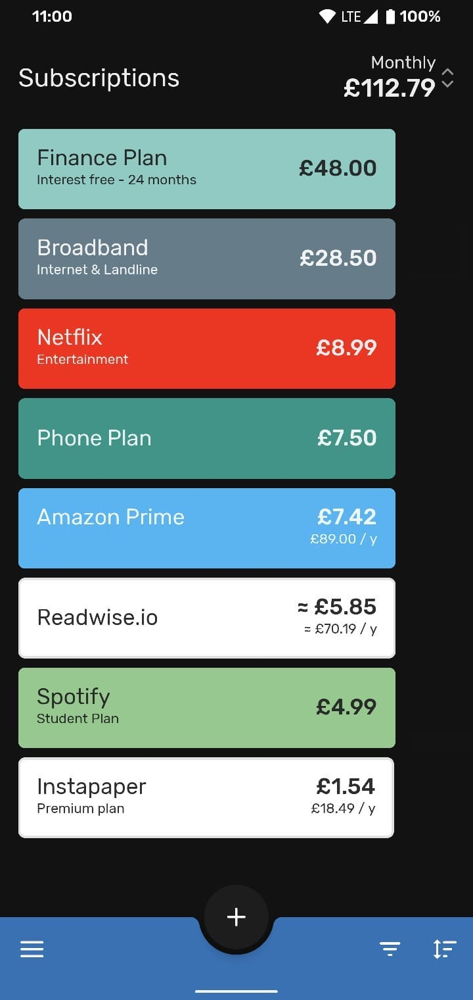

Hey folks 👋

Let’s talk about subscriptions because **everything is becoming a subscription**, from streaming services to software and even physical goods. Subscriptions are becoming a normal way of life and while a lot of them can provide a lot of value, they run up to hundreds (and sometimes thousands) of pounds a year.

**TL;DR - Have a look through all your subscriptions and cut out what you don’t use or need**

## What are we subscribing to more subscriptions? 

Barclays Payments claims that we’re becoming a ‘Subscription Society’ and that’s not far from the truth. [Research found](https://home.barclaycard/press-releases/2020/8/Lockdown-fuels-Subscription-Society/) that on average we’re shelling out about *£46 a month (£552 a year)* on subscription services and in April 2020, spending on digital subscription services increased by over 50% year on year.

Lockdowns accelerated the growth of subscription services - A lot of us took up a streaming service to get through the long periods at home and with shops closed, 22% of UK retailers launched a subscription service at the same time.

There’s also been another type of subscription that has been creeping up on us, and that is...

## Software subscriptions
The era of one-time payment software is starting to crumble, and in its place are subscription software services. Traditional computer software, apps on our phones and even video games (to some degree) are all turning into monthly subscription services. Subscriptions are great for companies that build software. It creates a recurring and predictable source of revenue that can be reinvested to build better products and services, however it might leave you with less money and a sense of obligation to use these services to *get your money’s worth* from them since you’ve already paid for them.

It can make sense to pay a subscription for great software but as a rule of thumb, I try to stick to only those that I’m able to get a lot of value out of or ones that help save me time such as my [password manager](https://1password.com/), my music streaming service, [Spotify](https://www.spotify.com/uk/) and most recently [Readwise](https://readwise.io/i/akash56) for tracking and syncing various notes and highlight across several sources. 

Most software subscriptions can be considered as ‘*optional*’ subscriptions. They are ones that you could probably cut out for a few months and be fine without. As an example, most fitness apps will have some type of subscription tied to *premium* content. 

See if you can try and find one of these types of subscriptions that you have and try canceling it or downgrading to the free plan instead to start saving some money.

## Service subscriptions
We’re starting to see more and more subscriptions that offer a service for a fixed monthly cost including but not limited to razor blades, recipe boxes, video games, newspapers and content streaming. As with software subscriptions, the same rule applies - Only keep the ones that prove to provide you value but also try not to be subscribed to different versions of the same type of service - You probably don’t need a subscription to two or more streaming services for example.

## Classic subscriptions
Fixed monthly costs can be thought of being subscriptions as well - You pay monthly for a service or product. So energy, internet, phone and rent/mortgage bills are what I would consider ‘classic subscriptions’. Instead of cutting these ones out, there are usually ways you could cut down on some of them which can end up saving you money. It could be as simple as checking if you are [overpaying for your phone plan](https://www.which.co.uk/news/2020/08/third-of-mobile-network-customers-still-being-hit-by-overpayments-rip-off/), switching to a cheaper energy supplier, or [haggling with your broadband provider for a cheaper deal](/archive/akashandmoney/busting-broadband-bills). 

## Keeping a track on subscriptions
We can easily fall for the trap of needing every subscription service thrown at us and also losing track of what we are subscribed to. I found it useful to track each of these subscriptions and how much they are costing me each month/year. I use an app on Android that’s simply called [Subscriptions](https://play.google.com/store/apps/details?id=de.simolation.subscriptionmanager) to do this. For iOS users, you can get something similar from the [Bobby](https://apps.apple.com/us/app/bobby-track-subscriptions/id1059152023) app. Thankfully neither of these apps have their own subscription service but there are some in-app purchases if you want to get some extra functionality from either app. 

 
^ *An example of what my [subscription tracking app](https://play.google.com/store/apps/details?id=de.simolation.subscriptionmanager) looks like*

### Further reading 
- [Why everything is turning into a subscription](https://web.archive.org/web/20180930115117/https://blog.unicornhunt.io/your-life-is-about-to-be-dominated-by-subscriptions-580c2ef410f9)
- [What’s Behind The Rise Of The Subscription Model](https://www.forbes.com/sites/forbestechcouncil/2019/08/12/whats-behind-the-rise-of-the-subscription-model/?sh=692fe14b35c3) 

Subscriptions are not going to go away anytime soon and inevitably if you don’t have one now, you’ll likely get one (or more) in the future. Subscriptions aren’t the end of the world but it’s just something to remain aware about and stay on top of, because while **we might be swimming in subscriptions today, tomorrow we could end up drowning in them.**